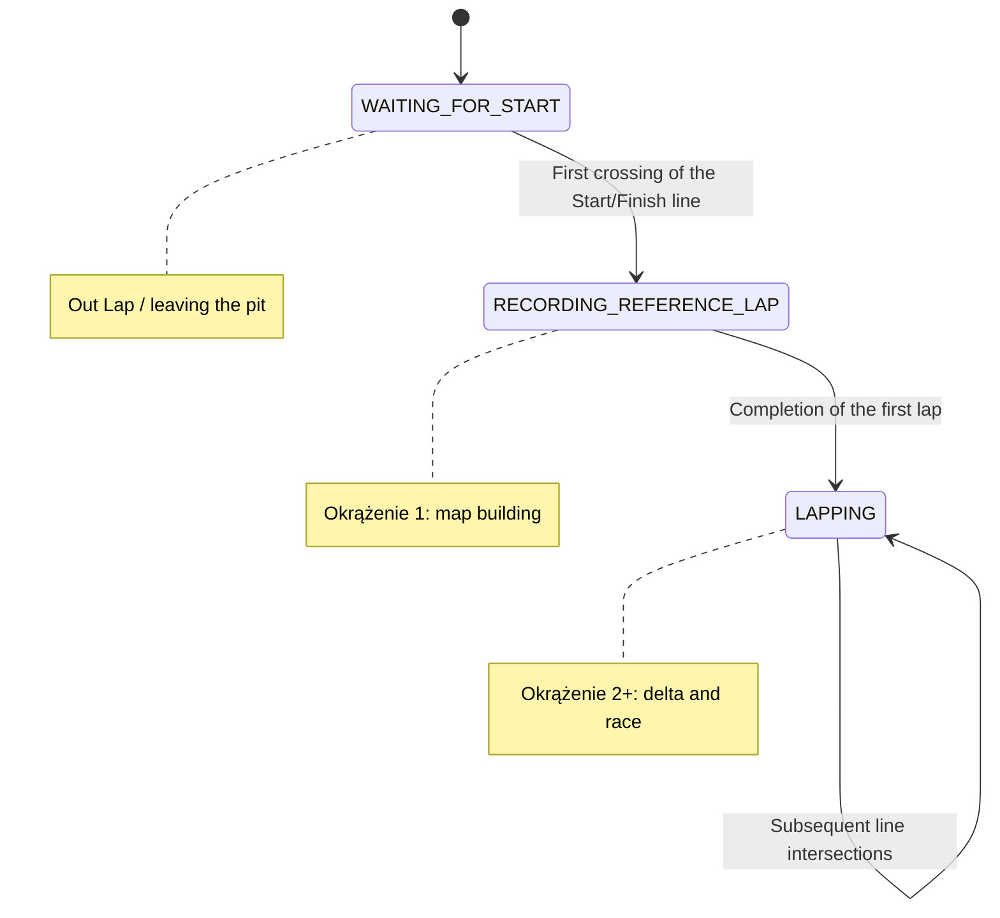

**PUTM Lap Timer**
=====================

**Overview**
------------

The PUTM Lap Timer is a ROS 2 package designed to measure lap times and calculate live delta performance for the Poznan University of Technology Racing Team.

This version implements a State Machine architecture to robustly handle the different phases of a race (Outlap, Reference Lap, and Lapping). It uses GPS data (sensor_msgs/NavSatFix) to track the vehicle's position, build a track map dynamically, and compare the current performance against the "Ghost Car" (Best Lap).

**Features**
------------

*State Machine Architecture: Robust handling of race stages.
*Live Delta Calculation: Spatial comparison between the current position and the best lap ("Ghost Car") using a Nearest Neighbor algorithm.
*Dynamic Map Generation: Automatically records the track path during the first flying lap.
*Robust Line Crossing Detection: Uses a "Closest Approach" algorithm to detect the exact moment of crossing the start/finish line, preventing false positives near the gate.
*Throttled Logging: Provides readable, real-time feedback in the console without flooding the output.

**State Machine Logic**
-----------------------
The node operates in three distinct states:

1. **WAITING_FOR_START (Outlap)**
   * The system waits for the car to approach the Start/Finish line (defined by GPS coordinates).
   * No timing or recording happens in this state.
   * **Transition:** Occurs when the car crosses the Start/Finish line.

2. **RECORDING_REFERENCE_LAP (First Flying Lap)**
   * The timer starts.
   * The system records GPS points (sectors) to build the `current_lap` map.
   * No delta is calculated yet because there is no reference.
   * **Transition:** Occurs when the car crosses the Start/Finish line again. The recorded lap becomes the `best_lap`.

3. **LAPPING (Race Mode)**
   * The system continues to record the current path.
   * **Delta Calculation:** For every GPS point, the system finds the closest point on the `best_lap` trajectory and compares the timestamps.
   * **Optimization:** If the new lap is faster than the `best_lap`, it overwrites the reference map for the next lap.

**State Diagram**
-----------------


**Usage**
-----

1. Launch the ROS node: `ros2 run putm_lap_timer lap_timer`
2. Configure the GPS device to provide NavSatFix messages
3. The lap timer will start measuring lap times and publishing data to the `/putm_vcl/lap_timer` topic

**Configuration**
-------------

The package provides several configurable parameters:

* `START_LAT` and `START_LON`: coordinates of the start/finish line
* `LAP_DISTANCE`: distance between start/finish line and sector points
* `DELTA_DISTANCE`: minimum distance between sector points

These parameters can be modified in the `lap_timer.cpp` file.


**Testing**
-------
Clone the repository: 
```bash
git clone https://github.com/PUT-Motorsport/PUTM_VP_LAPTIMER.git
```

Change branch to test branch

```bash
git checkout test
```
Build the putm_ws:
```bash
git clone --recurse-submodules git@github.com:PUT-Motorsport/putm_ws.git
cd putm_ws
colcon build
```
Run plotjuggler

```bash
ros2 run plotjuggler plotjuggler
```
Open db3 file with metadata.yaml. Make sure that ROS2 Topic Re-Publisher box is checked.

Enter your built LapTimer workspace
```bash
cd PUTM_VP_LAPTIMER
source install/setup.bash
ros2 run putm_lap_timer lap_timer
```


**License**
-------

This package is licensed under the Apache-2.0 license.

**Acknowledgments**
----------------

This package was developed by the Poznan University of Technology Racing Team.
