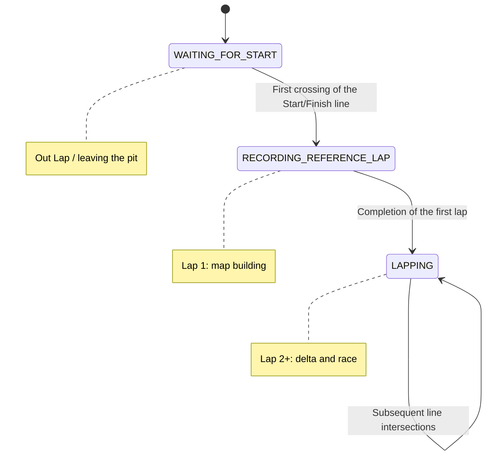

**PUTM Lap Timer**
=====================

**Overview**
------------

The PUTM Lap Timer is a ROS 2 package designed to measure lap times and calculate live delta performance for the Poznan University of Technology Racing Team.

This version implements a State Machine architecture to robustly handle the different phases of a race (Outlap, Reference Lap, and Lapping). It uses GPS data (sensor_msgs/NavSatFix) to track the vehicle's position, build a track map dynamically, and compare the current performance against the "Ghost Car" (Best Lap).

**Features**
------------

* State Machine Architecture: Robust handling of race stages.
* Live Delta Calculation: Spatial comparison between the current position and the best lap ("Ghost Car") using a Nearest Neighbor algorithm.
* Dynamic Map Generation: Automatically records the track path during the first flying lap.
* Robust Line Crossing Detection: Uses a "Closest Approach" algorithm to detect the exact moment of crossing the start/finish line, preventing false positives near the gate.
* Throttled Logging: Provides readable, real-time feedback in the console without flooding the output.

**State Machine Logic**
-----------------------
The node operates in three distinct states:

1. **WAITING_FOR_START (Outlap)**
   * The system waits for the car to approach the Start/Finish line (defined by GPS coordinates).
   * No timing or recording happens in this state.
   * **Transition:** Occurs when the car crosses the Start/Finish line.

2. **RECORDING_REFERENCE_LAP (First Flying Lap)**
   * The timer starts.
   * The system records GPS points (sectors) to build the `current_lap` map.
   * No delta is calculated yet because there is no reference.
   * **Transition:** Occurs when the car crosses the Start/Finish line again. The recorded lap becomes the `best_lap`.

3. **LAPPING (Race Mode)**
   * The system continues to record the current path.
   * **Delta Calculation:** For every GPS point, the system finds the closest point on the `best_lap` trajectory and compares the timestamps.
   * **Optimization:** If the new lap is faster than the `best_lap`, it overwrites the reference map for the next lap.

**State Diagram**
-----------------

```mermaid
stateDiagram-v2
    [*] --> WAITING
    
    state "WAITING_FOR_START" as WAITING
    note right of WAITING
        Out Lap / leaving the pit
    end note

    state "RECORDING_REFERENCE_LAP" as RECORDING
    note right of RECORDING
        Lap 1: map building
    end note

    state "LAPPING" as LAPPING
    note right of LAPPING
        Lap 2+: delta and race
    end note

    WAITING --> RECORDING: First crossing of the Start/Finish line
    RECORDING --> LAPPING: Completion of the first lap
    LAPPING --> LAPPING: Subsequent line intersections
```

**Mathematical Models & Algorithms**
------------------------------

To ensure high precision and reliability at racing speeds, the PUTM Lap Timer relies on several mathematical models to process raw GPS data. This section explains the core algorithms used in the node.

### 1. Virtual Gate Generation (Spherical Offset)

To detect a lap completion, the system creates a virtual Start/Finish line (a "gate") consisting of two posts (P1 and P2) perpendicular to the track's heading.

Because GPS coordinates (Latitude/Longitude) are angular measurements, we cannot simply add meters to them. We use a spherical earth approximation where the Earth's radius is $R = 6371000$ meters.

Given a center point ($Lat_{center}, Lon_{center}$), a heading angle $\theta$ (in radians), and a half-width $d$ (e.g., 10 meters), we first calculate the angle perpendicular to the car's direction:

* For the left post (P1): $\alpha = \theta - 90^\circ$
* For the right post (P2): $\alpha = \theta + 90^\circ$

The absolute coordinates for the gate posts are calculated by adding the spherical offset to the center coordinates:

$$Lat_{gate} = Lat_{center} + \left( \frac{d \cdot \cos(\alpha)}{R} \right) \cdot \frac{180}{\pi}$$

$$Lon_{gate} = Lon_{center} + \left( \frac{d \cdot \sin(\alpha)}{R \cdot \cos(Lat_{center})} \right) \cdot \frac{180}{\pi}$$

**Note:** The $\cos(Lat_{center})$ term in the longitude equation is crucial as it compensates for the shrinking distance between longitude lines as you move away from the equator.

### 2. Distance Calculation (Haversine Formula)

To accurately calculate the distance between two sector points, the node uses the Haversine Formula, which determines the great-circle distance between two points on a sphere.


For two points with latitudes $\phi_1, \phi_2$ and longitudes $\lambda_1, \lambda_2$ (all in radians), the distance $d$ is calculated as:

$$a = \sin^2\left(\frac{\phi_2 - \phi_1}{2}\right) + \cos(\phi_1) \cdot \cos(\phi_2) \cdot \sin^2\left(\frac{\lambda_2 - \lambda_1}{2}\right)$$

$$c = 2 \cdot \text{atan2}\left(\sqrt{a}, \sqrt{1-a}\right)$$

$$d = R \cdot c$$

Where $R$ is the Earth's radius ($6371000$ meters).

**Implementation Note:** In the C++ code (`haversineDistance` function), the mathematical $\sin^2(x)$ is optimized for CPU performance as `sin(x) * sin(x)` instead of using the `pow()` function. Additionally, since the raw GPS data from the VectorNav sensor is provided in degrees, the `degreesToRadians()` function is used dynamically within the equation to satisfy the mathematical formula's strict requirement for radians. This calculation is primarily used to ensure sectors are recorded at strict spatial intervals (e.g., every 0.5 meters).

### 3. Line Crossing Detection (Vector Cross Product)

Detecting when the car crosses the Start/Finish line is not done by checking if the car is "inside" a radius (which causes false triggers). Instead, it uses a **Line Segment Intersection** algorithm based on 2D Vector Cross Products.


We have two line segments:
* **Segment 1 (The Gate):** From post $G_1$ to post $G_2$.
* **Segment 2 (Car Path):** From the previous GPS coordinate $C_{prev}$ to the current GPS coordinate $C_{curr}$.

To check if these segments intersect, we calculate the cross product of the vectors. The 2D cross product of three points $A, B, C$ tells us if point $C$ is to the left or right of the line forming $A \to B$:

$$\text{cp} = (x_B - x_A)(y_C - y_A) - (y_B - y_A)(x_C - x_A)$$

The algorithm checks if $C_{prev}$ and $C_{curr}$ are on *opposite sides* of the gate segment, AND if $G_1$ and $G_2$ are on *opposite sides* of the car's path segment. If both conditions are true (indicated by changing mathematical signs of the cross products), the car has strictly intersected the start/finish line.


### 4. Dynamic Heading (Azimuth) Calculation

When the `reset_gate` service is called, the system must orient the new gate perpendicular to the car's travel direction. The node tracks a heading reference point and waits until the car moves at least 1 meter. It then calculates the forward bearing using the following formulas:


$$y = \sin(\Delta\lambda) \cdot \cos(\phi_2)$$

$$x = \cos(\phi_1) \cdot \sin(\phi_2) - \sin(\phi_1) \cdot \cos(\phi_2) \cdot \cos(\Delta\lambda)$$

$$\theta = \text{atan2}(y, x) \cdot \frac{180}{\pi}$$

This ensures the gate is always properly laid across the track, regardless of where the vehicle is initialized.

### 5. Live Delta Time (Nearest Neighbor Search)

During the `LAPPING` state, the node provides live performance feedback (delta time).
Rather than comparing times at strict geographic boundaries, the node stores a spatial array of the `best_lap` containing `[lat, lon, time_into_lap]`.


For every new GPS ping on the current lap:
1. It iterates through the `best_lap` array.
2. It uses the Haversine formula to find the element with the absolute minimum spatial distance to the car's current coordinates.
3. Once the closest "Ghost Car" point is found, it calculates:

$$\Delta t = t_{current} - t_{best\_sector\_timestamp}$$

If $\Delta t$ is negative, the current lap is faster (green sector). If positive, the lap is slower (red sector).


**Usage**
-----

1. Launch the ROS node: `ros2 run putm_lap_timer lap_timer`
2. Configure the GPS device to provide NavSatFix messages
3. The lap timer will start measuring lap times and publishing data to the `/putm_vcl/lap_timer` topic

**Configuration**
-------------

The package provides several configurable parameters:

* `START_LAT` and `START_LON`: coordinates of the start/finish line
* `LAP_DISTANCE`: distance between start/finish line and sector points
* `DELTA_DISTANCE`: minimum distance between sector points

These parameters can be modified in the `lap_timer.cpp` file.


**Testing**
-------
Clone the repository: 
```bash
git clone https://github.com/PUT-Motorsport/PUTM_VP_LAPTIMER.git
```

Change branch to test branch

```bash
git checkout test
```
Build the putm_ws:
```bash
git clone --recurse-submodules git@github.com:PUT-Motorsport/putm_ws.git
cd putm_ws
colcon build
```
Run plotjuggler

```bash
ros2 run plotjuggler plotjuggler
```
Open db3 file with metadata.yaml. Make sure that ROS2 Topic Re-Publisher box is checked.

Enter your built LapTimer workspace
```bash
cd PUTM_VP_LAPTIMER
source install/setup.bash
ros2 run putm_lap_timer lap_timer
```

### Dynamic Start Line Calibration (Gate Reset)

The LapTimer features a dynamic virtual start/finish line calibration that can be set anywhere on the track based on the car's current GPS position.
**How to reset the start line:**
To accurately calculate the gate orientation, the system needs to establish a motion vector. **You cannot reset the gate if the car has been stationary since startup.**
**Track Calibration Procedure:**
1. Drive the car forward for at least 1-2 meters from the startup point (this allows the system to calculate the correct heading/azimuth).
2. Stop before your desired start line. *(Note: The virtual gate will be placed exactly 1 meter ahead of the GPS antenna).*
3. Open a new terminal and call the reset service:
```bash
ros2 service call /lap_timer/reset_gate std_srvs/srv/Trigger {}
```
**Expected Results:**
If successful, the service terminal will output:
```console
response:
std_srvs.srv.Trigger_Response(success=True, message='Start Line Calibrated Successfully!')
```
The LapTimer will then reset the lap counters, close the active CSV log, and enter the WAITING_FOR_START mode until you cross the new line.
**Troubleshooting:**
If you receive success=False with the message "Car hasn't moved yet! Drive forward 1-2 meters first.", the vehicle hasn't traveled far enough from the GPS anchor point to calculate a heading vector. Drive a bit further forward and try again.

**License**
-------

This package is licensed under the Apache-2.0 license.

**Acknowledgments**
----------------

This package was developed by the Poznan University of Technology Racing Team.
